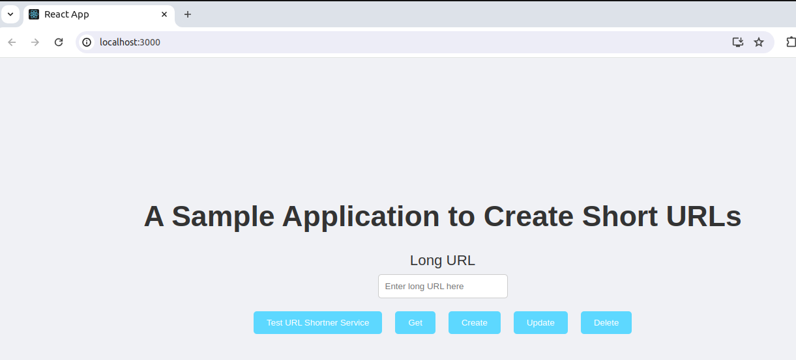
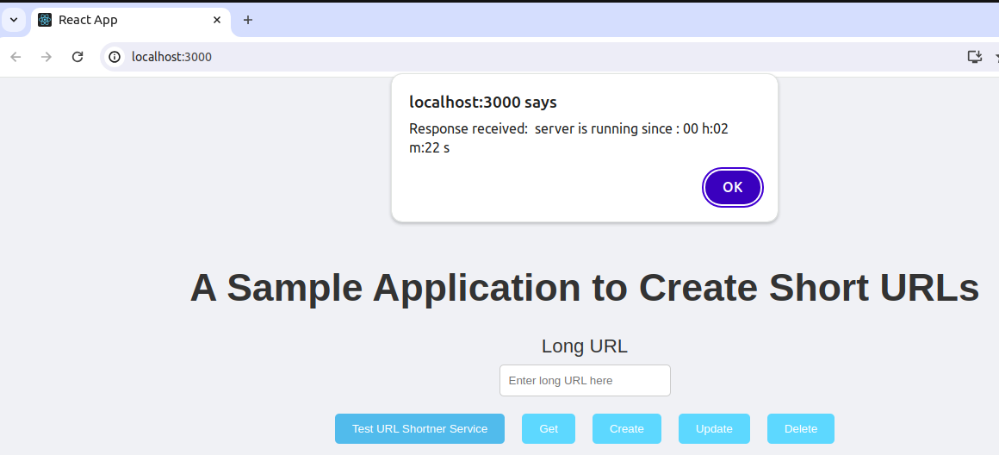
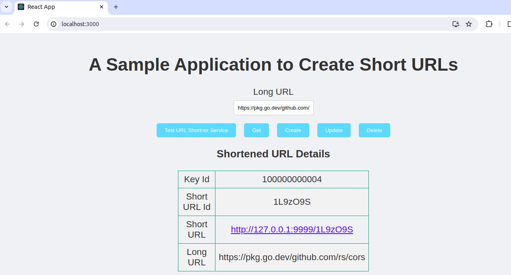
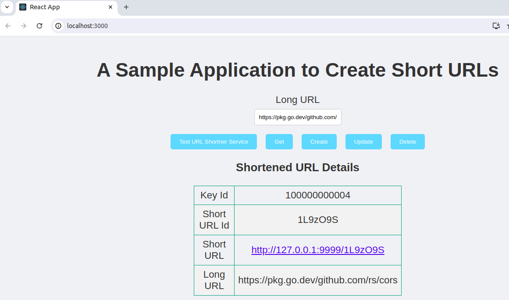
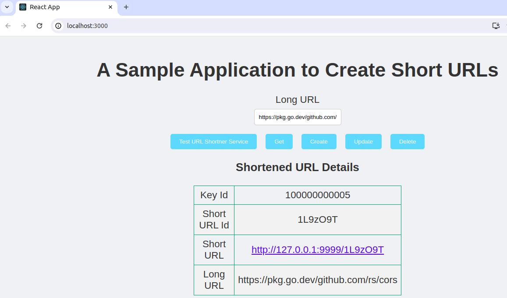
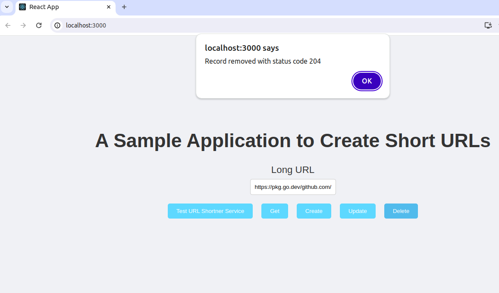

## Frontend Application to integrate with URL shortner application ##

This is a sample application to integrate with REST services which we exposed to develop our own URL shortner application.Experience quick, efficient URL shortening with a user-friendly interface.

[Download URL Shortner REST App](https://github.com/KumarVariable/go-for-url-shortner "Hold `Ctrl` or `Cmd` on the keyboard while clicking the link, to open link in new Tab").

## Prerequisites ##

- [Node.js, NPM, NPX](https://nodejs.org/en/download).

- Clone, Build and Deploy the REST application. [Here](https://github.com/KumarVariable/go-for-url-shortner).

### Getting Started with Create React App ###

This project was bootstrapped with [Create React App](https://create-react-app.dev/docs/getting-started/).

### Build and Run Application ###

1. To Build Project

```text
npm i --legacy-peer-deps
```
2. To Run the application in the development mode:

```text
npm start
```
3. Open [http://localhost:3000](http://localhost:3000) to view it in your browser.The page will reload when you make changes.



### Perform URL Shortner Operations ###

1. The URL Shortner REST application must be on [http://localhost:9999/test](http://localhost:9999/test)

2. To test the REST services application. Click on button `Test URL Shortner Service`



3. To Create Short URL: Provide the Long URL. Click on button `Create`.



Click on Short URL to be redirected to the Long URL.

4. To Get Short URL: Provide the Long URL to get Short URL details. Click on button `Get`.



5. To Update Short URL: Provide the Long URL to update Short URL. Click on button `Update`.



6. To Delete Short URL: Provide the Long URL to delete Short URL. Click on button `Delete`.



**Happy Learning !**